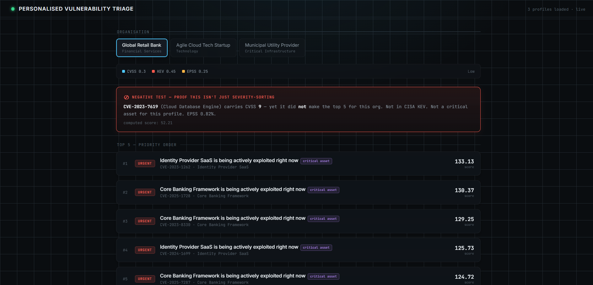
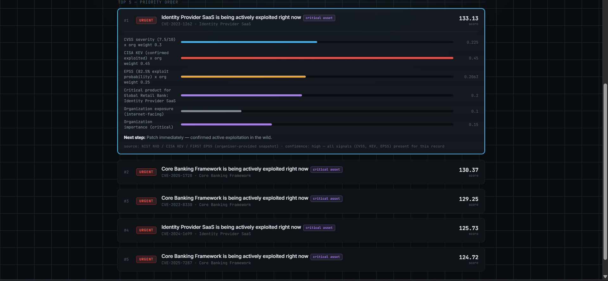

  

# Personalised Vulnerability Triage

24-hour hackathon prototype. Turns a public vulnerability feed into a ranked
top-5 list per organisation, with every ranking decision fully explained.


*Live dashboard showing organisation-specific weights and the negative test proof.*

## Contents
- [What it answers](#what-it-answers)
- [Quick start](#quick-start)
- [Data](#data)
- [How personalisation works](#how-personalisation-works)
- [Scoring formula](#scoring-formula-fully-visible-in-every-result)
- [Pipeline](#pipeline)
- [Validated against gold_set.csv](#validated-against-gold_setcsv)
- [Required negative test](#required-negative-test)
- [Assumptions](#assumptions)
- [Known limitations](#known-limitations)
- [What's not built](#whats-not-built-out-of-scope-for-this-challenge)

## What it answers

1. **What should I pay attention to?** — a ranked top 5, not a raw table.
2. **Why is this relevant to this organisation?** — every score breaks into
   visible, weighted factors; nothing is a black box.
3. **What should I do next?** — one concrete, safe action per item.

## Quick start

### 1. Start the Backend API
```bash
cd backend
pip install -r requirements.txt
cd app
uvicorn api:app --reload --port 8000
```
*(The API will run at http://127.0.0.1:8000)*

### 2. Open the Frontend
Double-click `frontend/index.html` in your file explorer, or open it in any modern browser. It will automatically connect to the local API.

### 3. (Optional) Run CLI tools
If you want to view outputs in the terminal instead of the web UI:
```bash
cd backend/app
python main.py            # top 5 per organisation, full explanation
python negative_test.py   # proves the system isn't just severity-sorting
python gold_validator.py  # sanity-checks ranking against practitioner data
```

No external databases or paid feeds required.

## Data

- `data/vulnerabilities.csv` — **540** CVEs: `cve_id, product_name,
  cvss_base_score, cisa_kev, first_epss`
- `data/profiles.json` — **3** organisations, each with its own
  `weight_modifiers` (how much it weights CVSS vs. KEV vs. EPSS) and a
  `critical_products` list
- `data/gold_set.csv` — 5 practitioner-ranked CVEs, used as a sanity
  check on the scoring formula (not used at runtime)

## How personalisation works

There's no version-matching in this dataset (no vendor/version columns),
so personalisation comes from three things that differ per organisation:

1. **A different risk formula.** Each org has its own `cvss_weight`,
   `cisa_kev_weight`, `first_epss_weight` — e.g. the Startup weights EPSS
   (exploit probability) at 0.6, while the Municipal Utility weights raw
   CVSS at 0.5. Same CVE, different score, for a principled reason.
2. **A different definition of "critical."** Every vulnerability is tagged
   `is_critical_product = True/False` based on whether its product appears
   in that org's `critical_products` list (`matcher.py`). Critical items get
   a fixed **`+0.20`** boost (`scorer.py`) on top of the weighted formula.
3. **Exposure and importance.** Internet-facing organisations get a
   `+0.10` boost; importance level adds `+0.15` (critical), `+0.08`
   (high), or `+0` (normal).

Nothing is excluded during matching — every vulnerability is scored for
every org, just weighted differently. This matters because the required
negative test (below) depends on non-critical, low-signal items still
being visible in the ranking, just pushed down.

> **Core principle:** Severity is one signal, not the answer. Every score is fully visible — no black box.


*Every score breaks into visible, weighted factors — nothing is a black box.*

## Scoring formula (fully visible in every result)

```
score = (cvss_weight  x cvss/10)
      + (kev_weight   x [1 if in CISA KEV else 0])
      + (epss_weight  x epss_probability)
      + (0.20 if product is one of this org's critical_products else 0)
      + (0.10 if organisation is internet-facing else 0)
      + (importance boost: 0.15 critical / 0.08 high / 0 normal)
```

Every term is printed alongside the result (`explainer.py`) — no single
opaque number.

## Pipeline

```
data_loader.py  -> loads CSV + JSON into typed objects
matcher.py      -> tags each vulnerability as critical/non-critical per org
scorer.py       -> computes the weighted score (incl. all boosts)
explainer.py    -> turns (vulnerability, score) into a judge-readable card
main.py         -> runs the full pipeline, prints top 5 per org
api.py          -> exposes the pipeline over HTTP for the frontend
```

## Validated against gold_set.csv

When scoring the 5 practitioner-flagged "gold" CVEs against the full
dataset of **540** vulnerabilities, here's what actually happens:

- **Global Retail Bank**: Only 1 of 5 gold-ranked CVEs lands in our top 5
  overall (it holds rank 1). The other four rank 13th, 37th, 120th, and
  437th — each has lower CVSS/EPSS and lacks KEV or critical-product
  status, so items in the active-exploitation cluster outrank them.
- **Agile Cloud Tech Startup**: 0 of 5 gold-ranked CVEs land in our top 5
  overall (the closest reaches rank 10) — same underlying cause.

**The pattern:** this formula heavily weights confirmed exploitation
(KEV) and critical-product status. Items a practitioner flagged for raw
technical severity alone often don't compete with that cluster. This is
a stated design trade-off — the formula rewards confirmed/likely
exploitation over theoretical severity — not a hidden defect.

## Required negative test

The brief requires showing one CVSS >= **9.0** item that does **not** make the
top 5, to prove the system isn't just severity-sorting. Confirmed working
for all three organisations (`negative_test.py`):

> `CVE-2023-7619` (CVSS 9.0) is excluded from Global Retail Bank's top 5 —
> it's not a critical product, not in CISA KEV, and has a 0.8% exploit
> probability. Score: 52.21, well below the org's top-5 threshold.

## Assumptions

- **`CRITICAL_PRODUCT_BOOST = 0.20`**, **`EXPOSURE_BOOST = 0.10`**, and the
  importance-tier boosts (0.15 / 0.08 / 0) are values we chose, not
  something the organisers specified — fixed constants so their effect on
  ranking is transparent and consistent across all organisations.
- All **540** vulnerability records have complete CVSS/KEV/EPSS values in
  this data pack, so `confidence` defaults to "high" for every record;
  `explainer.py` includes logic to lower this if any field were
  missing/zero, in case a sealed evaluation profile introduces gaps.

## Known limitations

- No version-range matching — this data pack doesn't include version
  columns, so unlike the generic brief template, there is no "installed
  version out of range" exclusion path.
- No `reference_url` or `source_snapshot_date` per CVE — this data pack
  doesn't include either column, so source is stated at the dataset level
  only ("NIST NVD / CISA KEV / FIRST EPSS, organiser-provided snapshot"),
  not per individual record.
- Gold-set CVEs mostly don't crack the top 5 (see above) — a known,
  explainable trade-off of a transparent formula, not a defect.
- `CRITICAL_PRODUCT_BOOST` is a flat additive constant; it doesn't scale
  with how many critical products an org has, or by sector.

## What's not built (out of scope for this challenge)

- Live API ingestion — frozen CSV/JSON snapshot only, as instructed.
- Authentication, accounts, deployment, multi-tenancy.
- Any offensive/exploit-related functionality — this prototype is
  defensive-only, per the brief's conditions of entry.